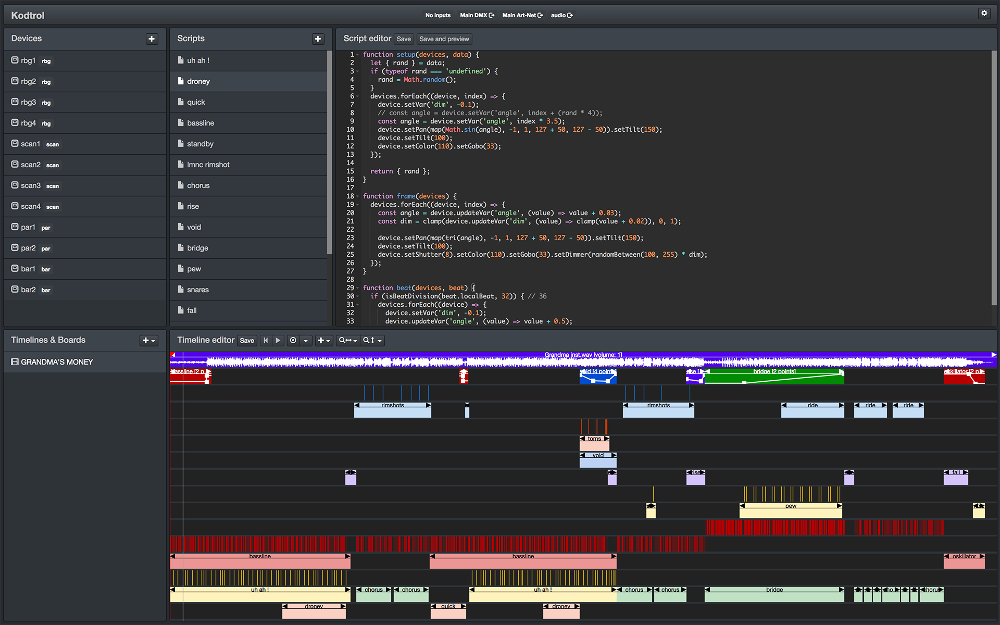

# Kodtrol


(Curious to see what the project in this screenshot looks like? [Here it is](https://youtu.be/CueEGW6SlJ0).)

# ⚠️ Note: this software is still in alpha stage. Use at your own risk; expect breaking changes without prior notice.
There is no executable build yet. Still an Electron noob. See "Local development / run from source" below.

## Features roadmap (in no particular order)
- [Open Fixture Library](https://open-fixture-library.org/) integration
- OSC/MSC/Serial outputs
- MIDI timecode sync
- Helpers Hub (where users can post their script helpers and share them)
- Manual and docs on [kodtrol.com](http://kodtrol.com)
- Display a nice first time "welcome" screen

## Known issues (fixing in progress)
- While the app is running, creating/opening subsequent projects will create an accumulation
  effect in the data store which will in turn generate duplicates for each new item (device, script, etc.)
  that you may create.
  - **Workaround:** after opening/creating a project, quit and relaunch the app.
- Audio tracks will continue playing after pausing a timeline.
  - **Workaround:** de-arm the timeline by clicking the red eye button at the top of the timeline list.
- A timeline/board item value may become un-copyable if it was previously edited in the contextual
  item's *Edit [item]...* modal.
  - **Workaround:** none in-app. You can edit your project's file and find the offending value in the 
  JSON and then make sure that if it's a numeric value (such as the start time and end time), it is not
  quoted.
- Sluggish UI modals when running a timeline or board.
  - **Workaround:** pause the timeline / un-arm the board that is currently running.
- Scripts `beat()` hooks are falling off-tempo when using a Art-Net output.
  - **Workaround:** use a non-Art-Net output. (This issue will be promptly addressed.)
- ~Cannot un-arm a board.~
  - ~**Workaround:** quit and relaunch the app. (Will require a UI change on how arming/un-arming is handled.)~
- Inputs/outputs crash after saving the configuration if they did not change.
  - **Workaround:** do not save the project configuration if you did not change it; otherwise, quit and
  relaunch the app.
- others i might have forgotten about...

## Local development / run from source

**Requirements**
- Node.js >= 10.x.x
- npm >= 3.6.x

Clone the repository and `cd` into it.  
Then:
```
npm install
npm run rebuild
npm run dev
```
And in another terminal, run:
```
npm start
```
Note that when starting the app the first time, you won't have an active project 
preloaded yet. Just go to *File > Create project...* to create one.