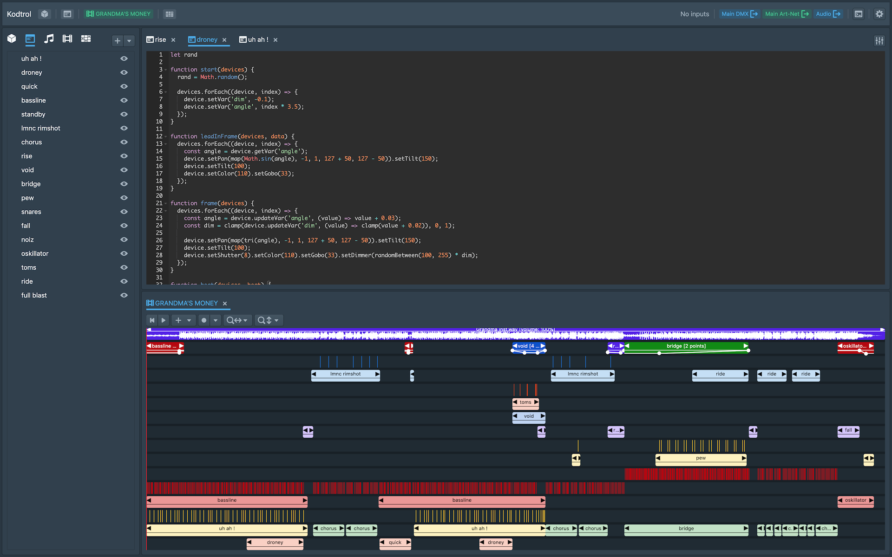

# Kodtrol

Above is a screenshot of a demo song project, [LOOK MUM NO COMPUTER - GRANDMA'S MONEY](https://youtu.be/CueEGW6SlJ0)  
Other demos:
- [Mr.Kitty - give/take](https://youtu.be/cN45Z7AZOg0)
- [Ladytron - The Island](https://youtu.be/ogRdrisVTpc)

# ⚠️ Note: this software is still in alpha stage. Use at your own risk; expect breaking changes without prior notice.

## Features roadmap (in no particular order)
- [Open Fixture Library](https://open-fixture-library.org/) integration
- OSC/MSC/Serial outputs
- MIDI timecode sync
- Helpers Hub (where users can post their script helpers and share them)
- Manual and docs on [kodtrol.com](http://kodtrol.com)

## Local development / run from source

**Requirements**
- Node.js: ^18.17.1
- npm: ^9.8.1
- Linux only: `libasound2-dev` package

Clone the repository and `cd` into it.  
Then:
```
npm install
npm run build:addons
npm run watch:renderer
```
And in another terminal, run:
```
npm start
```
If all goes well, you should see the Welcome Screen allowing you to create a new project or open an existing one.

## Local release build
Make sure you have installed the requirements from *Local development* above, then:
```
npm install
npm run build:addons
npm run build-and-dist
```
The build will be generated in the `dist` folder.